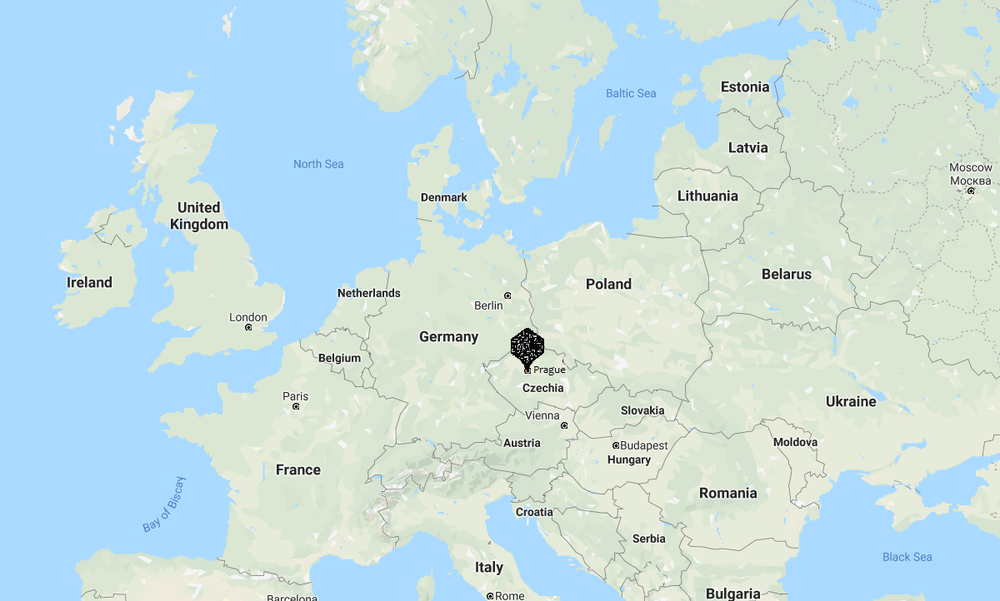
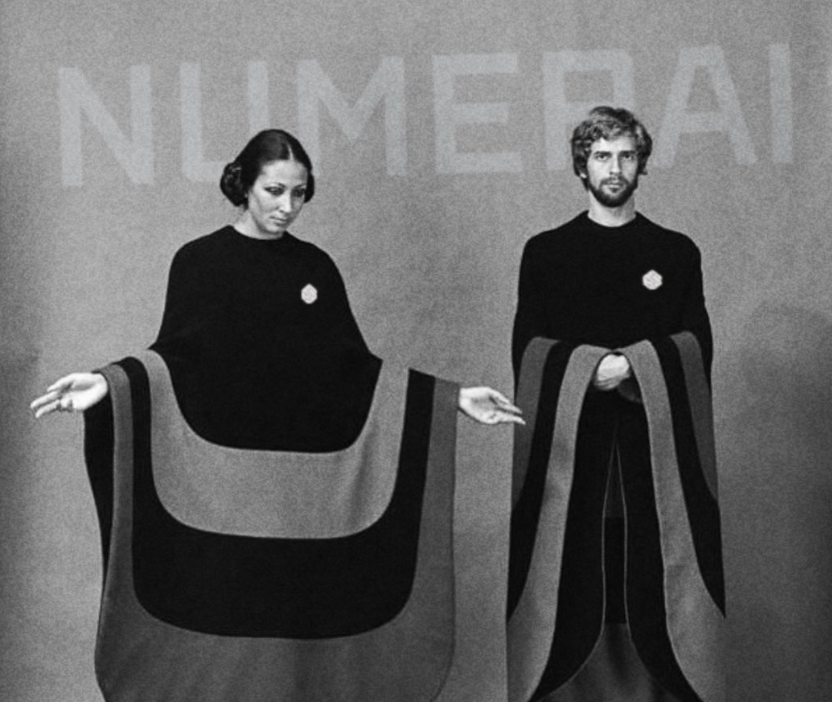
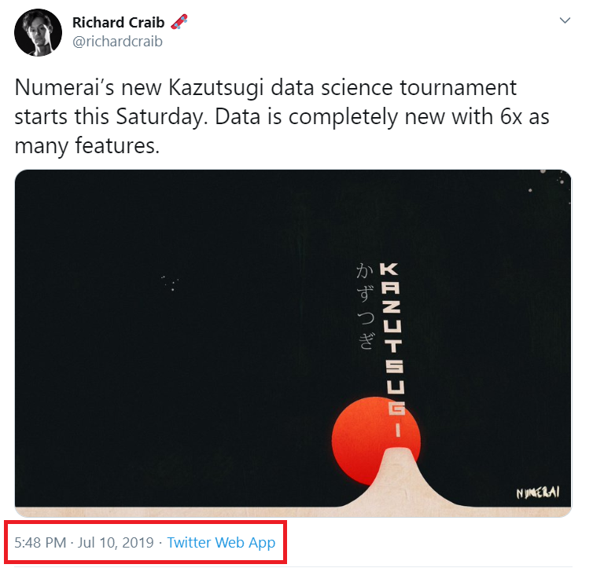

# OHwA S02E04

In this episode, Arbitrage interviewed longtime tournament competitor [Quantverse](https://twitter.com/CarlossVavros) from Prague. 

Check out the full transcript of his interview below the questions from Slido.

### Questions from Slido

### Interview with Quantverse

**Arbitrage:** So Quantverse, thanks for joining - where do you live?

**Quantverse:** I live in Prague, the capitol of the Czech Republic, a small country in Central Europe. It's already like, 10:00 pm now here.

**Arbitrage:** So Quantverse, what do you do for a living?

**Quantverse:** Well I don't have a "regular" job - for now[ I just live off of Numerai, actually](https://numer.ai/quantverse). But I dedicate time to more projects. One is designing automatic trading systems for cryptocurrency markets and market making.

**Arbitrage:** That's amazing!

**Quantverse:** It's still experimental. I'm still finding new strategies, so it's not live yet. But, hopefully it will be live in like, two months probably, for some testing. Before, I was doing arbitrage strategies - pun not intended!

**Arbitrage:** \( ͡° ͜ʖ ͡°\)

**Quantverse:** It was working fine in a time of really high volatility, but in the case of low volatility, it's not really that interesting. It's only when there are like, big moves in Bitcoin, that you really gain something. I think it's more interesting to focus on market making with a single system. Another project I have is a small website called [Pairs Trading](https://www.pairtradinglab.com/). It's a suite of tools to play with equity pairs trading. You can assemble a portfolio of pairs trading strategies, or there's also a really simple automated platform you can download so you can execute your strategies in real-time if you have an Interactive Brokers account - you can just let it go and it will automatically trade your pairs based on your rules. It's a small website, but there are some customers who like it. There was even a small hedge fund using it at one point.

**Arbitrage:** Awesome, post it in the chat so people can check it out. Now I can hit you with the next question: what would your parents say you do for a living?

**Quantverse:** Yeah...  that's a good question! They basically know I'm doing projects related to bitcoin. They kind of know what bitcoin is already. Actually, they think I work for some weird American hedge fund.

**Quantverse:** It was really difficult to explain how the whole Numerai project actually works, so they probably just think I'm an employee or contractor. Pretty much they know I'm doing some stuff related to brokers and exchanges, but they don't really know the details. I think it's enough for them to grasp the principles of what I'm doing.

**Arbitrage:** That's really cool.

**Quantverse:** But yeah, they think I work for an American company.  ¯\\_\(ツ\)\_/¯

**Arbitrage:** I think it's great that your primary income activity comes from the tournament. That's amazing, and I think there are probably several people in here who are striving to achieve that level. It's good to hear somebody is able to pull it off. What do you do for fun? You can't just push code all the time.

**Quantverse:** I also dedicate some time to photography. I have a few cameras and lenses, but lately I've found out it's more fun to actually downgrade back to film. So now I have film cameras, and I've tried to develop black and white photos myself.

**Arbitrage:** Nice!

**Quantverse:** It's neat because there's considerable costs for each frame you make, so it forces you to think about different ways to compose and make photos. I'm also a salsa DJ and salsa dancer- if you know south side and Latin dancing.

**Arbitrage:** Wait, so you DJ south side and Latin music?

**Quantverse:** Yeah.

**Arbitrage:** In Prague?

**Quantverse:** Yeah! There's a big scene actually.

**Arbitrage:** That's **so** cool.

**Quantverse:** There's a big community of dancers - it's fun.

**Arbitrage:** Let's talk about the tournament. When did you start participating? How old's [your account](https://numer.ai/quantverse)?

**Quantverse:** I started submitting in January 2017. It was still the old competition format where your performance was never weighted on live data but on some private holdout set. So that's how I started. I wanted to learn Python back then, I hadn't used it before, and to get some experience with machine learning. But just doing a project or some tutorials isn't very interesting so I wanted some motivation to compete and beat somebody and perhaps be lucky to get some bitcoin \(back then it was paid in bitcoin\). So I learned some Python and some machine learning just from this competition.

**Arbitrage:** It's very interesting how many of us turned to the tournament as a method of learning and then ended up being able to turn it into some profit. I think that's a wonderful part of this whole project. How did you find out about Numerai in the first place?

**Quantverse:** I was already into some quantitative finance blogs and social networks, because of my website, and somebody just shared it as something different, an interesting combination of machine learning, quantitative trading, and cryptocurrency. It caught my attention, and just a few months after I heard about it, I started to dedicate some time to making my first predictions. I found out about Numerai in the second half of 2016, and in January 2017 I started to build some models.

**Arbitrage:** So what do you wish you had known when you started out?

**Quantverse:** When we talk about the modeling part itself, I wish somebody told me that using the official validation data set for validation and choosing my models is not really a good idea. It's just too small to give you really good insights about your model.

**Arbitrage:** I hear from a lot of new users that they believe the tournament is too challenging and it becomes overwhelming and there's too much to handle. Why do you think people believe that?

**Quantverse:** I don't think it's that overwhelming by itself. Anybody can just take the example model and then try to make something better. Maybe people mean something else: the competition is changing so much, it's like every six months is practically a new tournament. Maybe people are just tired of changes. It's hard to guess because I don't really share that opinion myself.

**Arbitrage:** Yeah, if I started the tournament and then two weeks later there was a breaking change, I'd probably throw up my hands and walk away. Fortunately the latest changes haven't been very large. But [Anson](https://twitter.com/ansonschu), aren't we coming up on the one year anniversary of Kazutsugi? 

**Slyfox:** Almost! I think we're like, two months away.

**Arbitrage:** You at least announced it this time last year, if I remember correctly.

**Arbitrage:** And then there was work leading up to launching. So let's call it an 18-month development process with iterations on it live. I think this is the most stable we've seen the tournament. What's changed, of course, is that binary outcome where you have a full loss if you burn. To me, that's been the most welcome change because it's given a lot of stability and confidence in my modeling. 

**Quantverse:** I still remember that when Kazutsugi was introduced, I wasn't initially happy about it because I had to switch my modeling from classification to regression and make a lot of changes and such. But now, after almost one year, it's been the best change that happened to the competition because the data set is much more stable to model.

