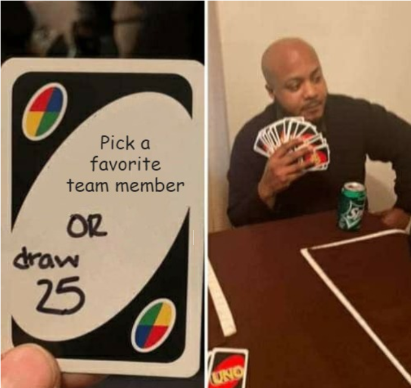
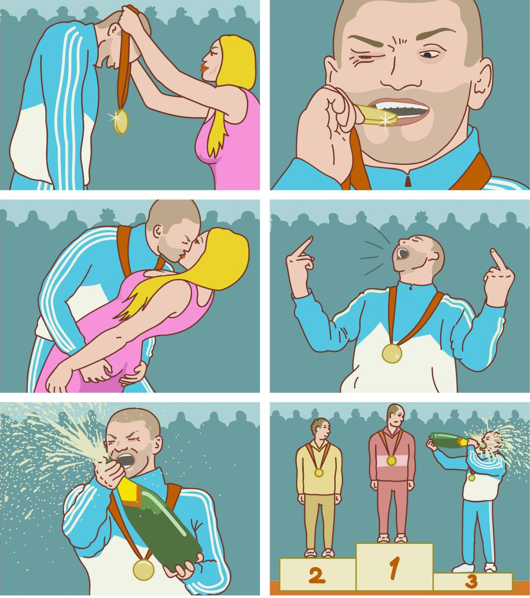

# OHwA S01E12

After what was totally not product placement for a popular brand of flavored carbonated water, Arbitrage kicked off episode 12 by interviewing longtime tournament data scientist [JRB](https://numer.ai/jrb).

### The one where Arbitrage interviews JRB

**Arbitrage:** How did you find out about Numerai?

**JRB:** I think it was sometime around Christmas in 2015. I was living in Dubai at the time. What people in Dubai usually do around Christmas is go on vacation, but I had to cancel mine for some reason. A friend of mine told me about this weird crypto machine learning tournament which operates on [homomorphically encrypted data](https://www.reddit.com/r/MachineLearning/comments/3zvuge/encrypted_data_for_efficient_markets_an_mnist_for/cyprq84/). I told him that was impossible - I had concluded that homomorphic encryption just wasn't there yet. But I took a look at Numerai and built a really stupid model and submit some predictions. It was a monthly tournament at that time, and I forgot about it for a while but at the end of the month I got a payout \(which is probably a lot of money now\). But from then on, I was hooked!

**Arbitrage:** I just scoped your [profile](https://numer.ai/jrb) on the Numerai website and your model woke on January 7, 2016, so you're the first person I've interviewed here who started their account before I did. Congratulations - you're officially the oldest OG.

**JRB:** When did you start your account?

**Arbitrage:** April \[2016\].

**JRB:** Oh not too far off.

**Arbitrage:** Yeah not far. I think I mentinoed that I actually found Numerai through the Quantopian forum - someone mentioned it there and I was looking for a project that was domain-related. Since it was stocks, it was like oh! This is great!

**JRB:** Do you remember someone named [WSW](https://numer.ai/wsw)?

**Arbitrage:** Ohhh yes.

**JRB:** It would be great if you could interview him or her.

\*\*\*\*[**NJ**](https://twitter.com/tasha_jade)**:** I can ask.

**Arbitrage:** Their account started in December of 2015, so they're the real OG. So you were in Dubai, moved to Ireland, had a couple of gaps in the tournament \(as many of us did\). What motivated you to start participating again?

**JRB:** Kaggle was fairly boring, and this was a bit of an enigma and a challenge. Nobody tells you what Numerai is. I'm naturally drawn to hard problems. As is everyone else in the tournament, I believe.

**Arbitrage:** Yeah, it's like the itch you can't scratch. Your commentary always makes me think, 'wow this person must work for scikit-learn or something' but before I get to that, where do you live in the world?

**JRB:** I live in Dublin, Ireland.

**Arbitrage:** So what do you do for a living that's got you so honed in on neural nets?

**JRB:** So I'm working on a federated learning startup by day. I can't afford to hire any employees so I do a lot of work with neural nets during the day. These are computer vision neural networks, and I try to quantize them and get them to work on small devices like cell phones.

**Arbitrage:** Whoa time out! What does quantize mean in the context you're talking about?

**JRB:** So when you train a neural network, you train them with floating point numbers \(usually 32 or 16 bit floating point\). But it's much faster to turn these continuous numbers into discrete integers. You have a couple of different algorithms for pruning which is essentially tweaking the neural network and quantizing it, hopefully with a very small loss in accuracy but with a great performance boost. 

**Arbitrage:** You mentioned that you're putting these algos directly on chips in cell phones, is that right?

**JRB:** Well you don't really put them directly on the chip, every cell phone these days comes with a neural net accelerator. It essentially runs on that, nothing fancy. 

**Arbitrage:** You say it's nothing fancy but it kind of blows my mind! 🤯 So what programming language are you using and why? Specifically for the tournament, for now.

**JRB:** I don't really like Python that much -

**JRB:** I used to work on making Python faster at Facebook for Instagram. I think I know a little bit too much about the internals of Python to like it. But it's super convenient for the tournament. So I just use Python for the tournament.

**Arbitrage:** So you're using Python and none of your crazy neural net stuff?

**JRB:** I was using TensorFlow for the longest time until I discovered this other neural net library from Google called [JAX](https://jax.readthedocs.io/en/latest/notebooks/quickstart.html). I use that a lot these days. [Michael Oliver](https://numer.ai/mdo) said it looks a lot like PyTorch.

**Arbitrage:** This one's going to be pretty clutch because I think you'll have some tips that nobody's said before. What are your top three tips for the tournament?

**JRB:** I don't know if they're going to be any good but: one thing I've learned in the past month is that I've been looking at the problem from the wrong perspective. This is something to think about - we treat this problem as a regression problem. What is there's a better way to do this? The metric we're trying to optimize for is a ranking metric, so the scales of your predictions don't matter at all. That's one reason why a lot of people rescale their predictions which helps if you're ensembling things \(averaging works better if everything is on the same scale\). Your metric doesn't have to be anything like mean squared error,   or any one of those regression methods. I think the only requirement for your loss function is that it has to be [comonotonic](http://homepages.ulb.ac.be/~grdeelst/DJV.pdf) with the labels - when the label goes up it should go up and when the label goes down it should go down. And that's all that matters. With that in mind, if we try to optimize for mean squared error, you're incentivizing your learner \(whether it's a tree-based learner or a neural net\) to memorize. You're saying, 'here's a curve, learn this curve.' 

**JRB cont:** Memorization can get you so far, but if you want to do better than that, you've got to learn the rank. This is a problem you see in ads and search, as well. This is another machine learning problem called learning to rank. It doesn't really matter if you're using a neural net or XGBoost or whatever, practically every tree-based method has a ranking module in it. Just to test this hypothesis, just like 45 minutes before I talked to you I [tweaked](https://forum.numer.ai/t/learning-to-rank/454) the [example predictions](https://github.com/numerai/example-scripts/blob/master/example_model.py). It took about half an hour to train, but you can switch XGBoostRegressor with XGBoost Ranker without tweaking any of the hyperparameters. You can get really fancy with neural nets. 

**Arbitrage:** JRB I don't need more stuff to work on this week, man. You're killin' me, man. So your first tip was to try it as a ranking problem instead of a minimize error problem. What else you got for us?

**JRB**: When it comes to neural nets, you can innovate in one of three ways: you could think about a novel architecture, you could try a lot of different regularization techniques, and third area is in terms of loss functions. For ranking problems, there are three approaches: pointwise ranking \(which is what we're doing using a regressor to predict the rank of every single data point\), pairwise ranking \(where you train a neural net or learner to do a comparative sort\), and the third way is listwise ranking \(where you feed your learner a list and it ranks the list for you\) - this is only possible with neural nets. 

**JRB cont:** Another non-tech tip is that people should be very critical of what they read on the forums because I see a lot of 💩 there. Some people are actively giving bad advice. I hate to call people out about this because I don't like to be confrontational, but it's sort of an adversarial environment.

**Arbitrage:** Yeah totally, I mean, I don't want people to be higher rank than me.

**JRB:** \[laughs\]

**Arbitrage:** It's a sincere problem with finance in general: we don't want to share what works.

**JRB:** On the other hand, there are a lot of people who want to help you with genuinely good ideas. 

**Arbitrage**: I think 99% of activity has good intentions, but you're right there is a bit of shadiness.

**JRB:** I'm not very good at remembering things, but [Bor](https://numer.ai/bor1) has a lot of good ideas. So does Michael Oliver. And all the people from the team. 

**Arbitrage:** I don't trust [the aliens guy](https://numer.ai/themicon), just sayin'. 

**JRB:** I guess that's it in terms of tips.

**Arbitrage:** Yeah, you know, nobody's really brought up that we're competing against each other and pointed out that it's possible people are giving purposefully bad advice. I think it may occur, and I do believe it's isolated. In order to win money in the tournament, you have to put money at risk and it comes down to the fact that it's your money, and so you need to do your own research before you deploy **anything** live. But that does not mean you should test it in production.

**JRB:** Yeah, that's a feature of the world we live in. Use your instincts and your best judgement. 

**Arbitrage:** That was a lot to unpack. That ranking bit is really interesting, I need to do some homework on that so I can educate myself. You're right, we are ranking. Correlation, yes, but ranking is the actual task at hand. I don't know why that didn't occur to me much sooner.

**JRB:** Somebody must have figured this out months ago and not mentioned it.

**Arbitrage:** It's definitely possible that some of the models on top are just looking at the problem in a completely different way.

**JRB:** One more thing worth adding here,:in the context of traditional ranking, pairwise ranking almost always beats pointwise ranking. So it's strictly superior to pointwise ranking. I don't know if that will be the case in the tournament, but it's certainly worth checking out.

**Arbitrage:** Excuse me while I go build a ranking model and use that as my MMC-chasing model. Here's a really important question, one that's a little controversial: who is your favorite team member?

**JRB:** Oh, that's tough.

**JRB:** What's the tally for the votes at the moment?

**Arbitrage:** No, I can't divulge, if you can't remember we're just going to have to chalk that one up to brain fog. Gotta pick.

**JRB:** I'm kind of biased towards Anson and NJ because I've met them IRL. 

**Arbitrage:** But now we have a pairwise ranking problem - you have to put one above the other. So there it is.

**JRB:** I think I'll go with [Patrick](https://twitter.com/pschork) because the multi-models thing has been a game changer.

**Arbitrage:** That was unexpected - I love it when that happens. Makes for good entertainment value. NJ and Anson are tied, 3-3 split, and now Patrick has a vote. 

**JRB:** Oh Patrick had no votes?

**Arbitrage:** Well he only revealed himself for the first time [a few weeks ago](https://docs.numer.ai/office-hours-with-arbitrage/office-hours-recaps/ohwa-s01e08), so that's his own fault. 

**JRB:** I hope [Mike P](https://twitter.com/EasyMikeP) gets a vote as well.

**Arbitrage:** I think Mike has a vote. I don't remember, I only keep track of the top. Mike, do you remember your vote count?

**Mike P:** Richard mentioned me with like four other people so I have 1/5 of a vote.

**Arbitrage:** If we had honorable mentions, I do think Mike's pretty high up there. 

**Arbitrage:** What is your number one feature request or suggestion for improvement for the tournament?

**JRB:** I don't know - the multi-model thing was at the top of my list for a long time and now that's done.

**Arbitrage:** Do you have ten models now?

**JRB:** Yeah, I do. I've got like 10 NMR staked on each of them, but I'm really waiting on the results of MMC. Hopefully I'll add more for staking once I have some more data. 

**From chat: JRB, do you have any advice on validation methods for neural nets on Numerai data? I'm having a hard time preventing overfitting.**

**JRB:** Preventing overfitting is more about regularization rather than validation. Having a holdout set for validation and not touching it during training is probably the way to go. Once you have a model architecture that you're confident in, maybe you could consider training on validation data, but I still don't do it. To answer the question: I don't know what methods you're using, but maybe take a look at L1 regularization or maybe even dropout, things like that, to try not to overfit your network. There's a lot of overlap in the features, and I think there's a reason why they're grouped. Try dropping them out one at a time. 

### MMC is now live

Earlier in the day before Office Hours, Mike P [announced that MMC staking is live](https://forum.numer.ai/t/metamodel-contribution-live/449) and publicly available for data scientist who want to stake on MMC instead of correlation. Originally planned for a May 31st release, according to Mike the last pieces came together quickly and they decided to launch because the feature was ready and there was no reason to hold it back.  

MMC's live debut came with a few subtle design changes to the Numerai tournament website with the introduction of grey \(correlation\) and orange \(MMC\) badges next to staked model names to display what they are staking on, and a greyed-out correlation line on the graph under a user's 'Submissions' tab. "On the submission page where correlation is greyed-out," Mike said, "if you submit on MMC, that score will be orange as well - it indicates for each round which you're getting paid on."

Arbitrage asked Mike if he's noticed people moving to MMC because his correlation with the meta-model has been steadily decreasing. Mike hasn't checked recently, but a few weeks before this episode, Mike said models were converging on [Example Predictions](https://numer.ai/integration_test). 

### Questions from Slido

**What other types of models or strategies could we try for MMC that are not the current popular ones like boosted trees or neural nets?**

At this point, Arbitrage said he isn't familiar with any ways to boost MMC outside of the standard ways that have been discussed in [Rocket.Chat](https://community.numer.ai) and the [forum](https://forum.numer.ai). Mike P added that he believes neural nets are still a very viable strategy. "Just because a lot of people are using them," he said, "doesn't mean you can't get MMC from neural nets. There's so much you can do with them."  

Arbitrage said ensemble techniques can also generate a lot of unique signals that are still good, and [Rudi](https://numer.ai/themicon) added that JRB's earlier tip about removing entire feature groups has been successful for him as well. "I've got models that use less than a third of the features," Rudi said, "but I was astounded at how different their MMCs were. The correlations aren't that great, but the MMCs are really good."  

Arbitrage is waiting for a model to post scores that show MMC and correlation clearly behaving in uncorrelated ways. He thinks a model that can accomplish that would be really interesting. The risk he sees in chasing MMC at the moment is that even if you have a really high MMC, you can still be punished because of the way [MMC payouts are calculated](https://forum.numer.ai/t/mmc-payout-details-and-analysis/220). 

As for strategies, Arbitrage speculated that one possible strategy for MMC might be mixing in predictions from a completely different kind of model with those generated by your production model, "like adding a linear model in some kind of weighted scheme to your interactive model of choice."

**Are the live targets we are scored on the actual ranking values, or also obfuscated before calculating the scores?**

Arbitrage speculated that our predictions are scored like a probability. Data scientists give float values as predictions, ranging from 0 to 1, and predictions they're not really sure about end up at .5. He said if you look at the tails, top and bottom, and pretended that was a portfolio of a long and a short, you can kind of see how you would do with regards to performance. "For our actual results," he said, "you take our predictions, put them in a rank from high to low, and then take the actual stocks and see how they did ranked high to low, and compare how similar those are. That's your scoring metric." 

Mike P added that the live targets are calculated exactly the same as the training targets and they are related to stock performance in some way, but a very abstracted way. 

"It is a Richard Craib creation, so it's going to be a little funky," Arbitrage said, "and I mean that with all due respect."

**What's the neural net equivalent of the** [**Integration Test**](https://numer.ai/integration_test) **model?**

> "I would say that's [Master Key](https://numer.ai/master_key), and we're all patiently waiting for that code to be released" - Arbitrage

**Mike P:** It is on my list for maybe later this quarter to write some more example code and example prediction-type stuff. I'm not sure if it will be the Master Key code, but it will be some simple neural net.

Richard said that it was Numerai's responsibility to give data scientists a pipeline of sorts that will get them to a decent result, and it's up to everybody else to make it better, "simply because we're all unwilling to give away our secret sauce," Arbitrage said. 

**How can one successfully implement one of these auto-ML-like strategies with Numerai's data?**

According to Arbitrage, just figure out how to input the data. He mentioned ML Jar \(OG [user](https://numer.ai/mljar_com)\), but is also the name of an [automated pipeline](https://mljar.com/automl/). These strategies were performant years ago, and do work. Arbitrage said that the user ML Jar posted in the [data science channel](https://community.numer.ai/channel/datascience) of Rocket.Chat some of the things they were working on and some example code. 

_If you’re passionate about finance, machine learning, or data science and you’re not competing in_ [_the most challenging data science tournament in the world_](https://numer.ai/tournament)_, what are you waiting for?_

_Don’t miss the next Office Hours with Arbitrage : follow_ [_Numerai on Twitter_](http://twitter.com/numerai) _or join the discussion on_ [_Rocket.Chat_](https://community.numer.ai/home) _for the next time and date._ 

_Thank you to_ [_Mike P_](https://twitter.com/EasyMikeP) _for fielding questions during this Office Hours, to_ [_Arbitrage_](https://numer.ai/arbitrage) _for hosting, and to_ [_JRB_](https://numer.ai/jrb) _for being interviewed._

